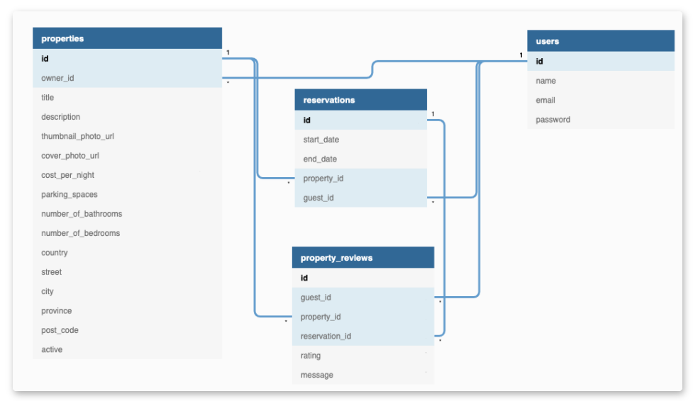

#Light BnB ERD

Below is what our database ERD will look like for Lighthouse BnB



##Database folder structure

```
├──LightBnB 
      ├── migrations
      │       ├── 01_schema.sql
      │ 
      ├── seeds
      │      ├── 01_seeds.sql
      │      ├── 02_seeds.sql
      │ 
      ├── LightBnB_WebApp
```

* `migrations` contains the database schema
* ` seeds ` contains the initial test database used for working with the project
* `LightBnB_WebApp` contains all overall structure of the app that contains the front end and back end coding. A separate readme will is visible inside the folder for full details.